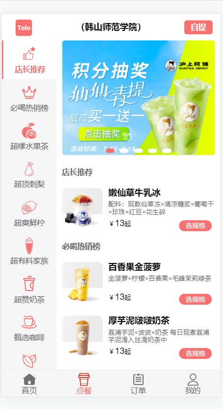
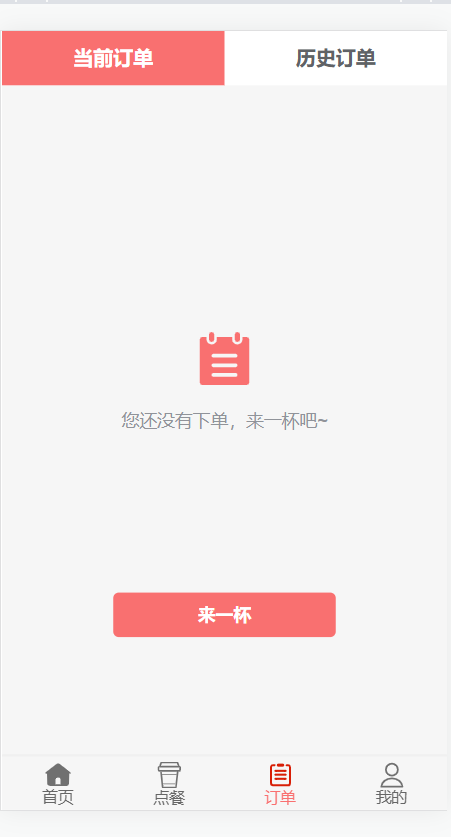
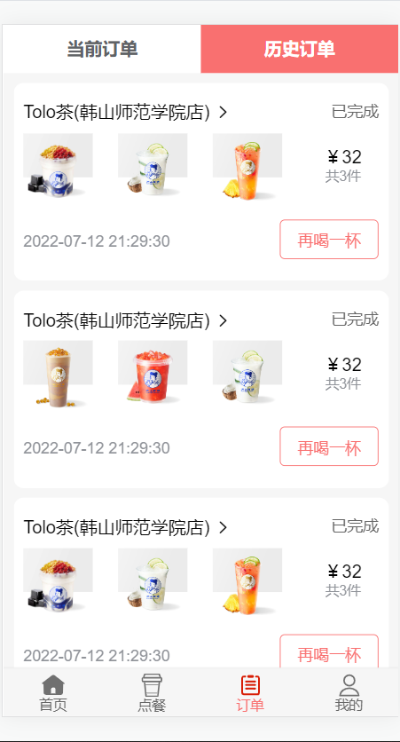
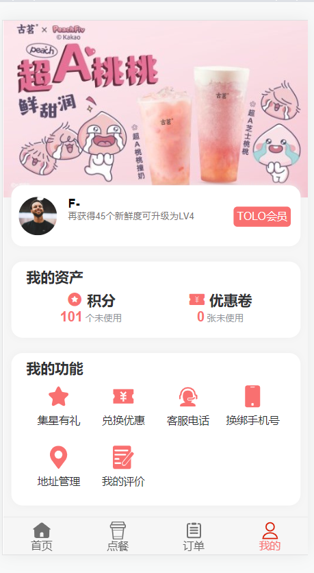

<h2 align="center">Tolo奶茶</h2>

<div align="center">

  	<a href="https://github.com/vuejs/vue">
    		
 	 </a>
</div>

Tolo奶茶是一个前端移动端的奶茶点餐系统，基于vue2与mockjs开发的移动端项目。基于mockjs产生模拟数据，编写后台模拟接口，通过拦截前端的网络请求传递模拟数据进行渲染页面，已经实现奶茶点餐系统的相关功能，内含多类功能化组件的封装运用。

### 功能简介

------

- 路由跳转
- 奶茶点餐
- 结算记录
- 订单获取

### 系统演示

------

#### 系统截图

- 系统首页


- 点餐页面



订单页面






- 个人页面

  


### 安装步骤

------

```bash
# 安装依赖
npm install

# 访问地址 http://localhost:8080
npm run serve

# 编译打包
npm run build
```

### 浏览器兼容

------

| [](http://godban.github.io/browsers-support-badges/)<br>IE / Edge | [](http://godban.github.io/browsers-support-badges/)<br>Firefox | [](http://godban.github.io/browsers-support-badges/)<br>Chrome | [](http://godban.github.io/browsers-support-badges/)<br>Safari | [](http://godban.github.io/browsers-support-badges/)<br>Opera |
| --------- | --------- | --------- | --------- | --------- |
| IE11, Edge| last 2 versions| last 2 versions| last 2 versions| last 2 versions

### 捐赠

------

**项目的创作离不开您的支持，如果你觉得此项目能够帮助到您，不如点个star支持作者吧， 谢谢！**

------

本项目部分图片资源来自沪上阿姨小程序、古茗小程序图片资源